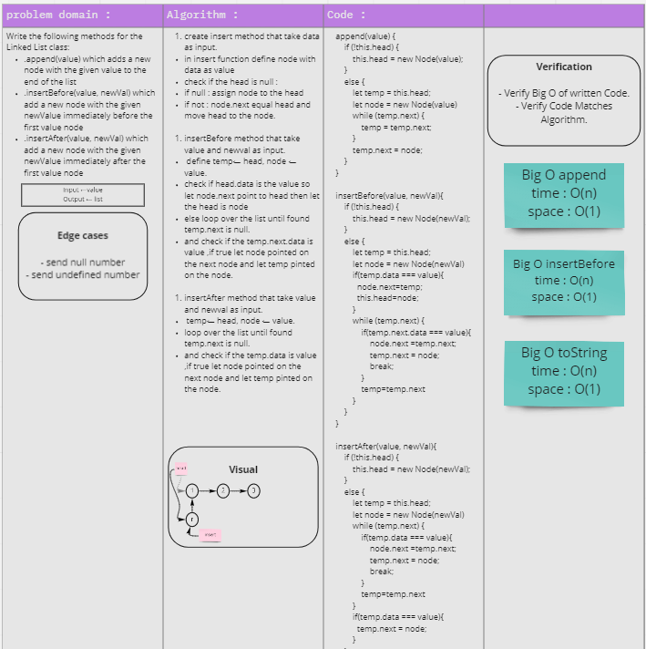

# Singly Linked List
Like arrays, Linked List is a linear data structure. Unlike arrays, linked list elements are not stored at a contiguous location; the elements are linked using pointers.

## Challenge

- Write the following methods for the Linked List class:

- `.append(value)` which adds a new node with the given `value` to the end of the list
- `.insertBefore(value, newVal)` which add a new node with the given `newValue` immediately before the first value node
- `.insertAfter(value, newVal)` which add a new node with the given `newValue` immediately after the first value node

 

## Whiteboard

## Solution
[test](https://github.com/AnwarAbbass/data-structures-and-algorithms/pull/17/checks?check_run_id=2653381890)
