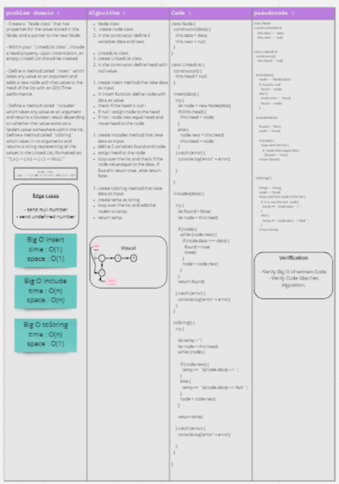

# Singly Linked List
Like arrays, Linked List is a linear data structure. Unlike arrays, linked list elements are not stored at a contiguous location; the elements are linked using pointers.

## Challenge

- Write the following methods for the Linked List class:

- `.append(value)` which adds a new node with the given `value` to the end of the list
- `.insertBefore(value, newVal)` which add a new node with the given `newValue` immediately before the first value node
- `.insertAfter(value, newVal)` which add a new node with the given `newValue` immediately after the first value node

- Create a `Node class` that has properties for the value stored in the Node, and a pointer to the next Node.
- Within your `LinkedList class`, include a head property. Upon instantiation, an empty Linked List should be created.
- Define a method called `insert` which takes any value as an argument and adds a new node with that value to the head of the list with an O(1) Time performance.
- Define a method called `includes` which takes any value as an argument and returns a boolean result depending on whether that value exists as a Node’s value somewhere within the list.
Define a method called `toString` which takes in no arguments and returns a string representing all the values in the Linked List, formatted as:
`"{ a } -> { b } -> { c } -> NULL"`

 

## Whiteboard

[to see it more clearly](https://miro.com/app/board/o9J_lC4ptN0=/)

## Solution
[test](https://github.com/AnwarAbbass/data-structures-and-algorithms/pull/17/checks?check_run_id=2653381890)

