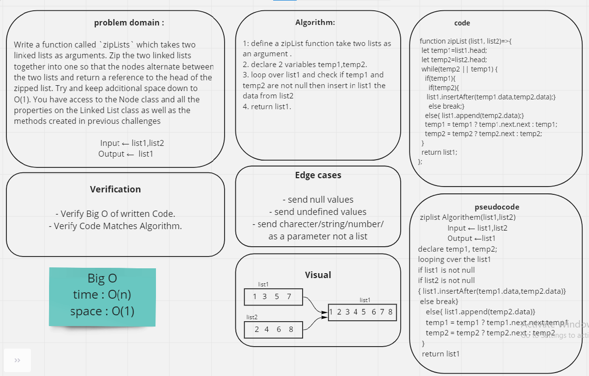

# Singly Linked List
Like arrays, Linked List is a linear data structure. Unlike arrays, linked list elements are not stored at a contiguous location; the elements are linked using pointers.

## Challenge

Write a function called `zipLists` which takes two linked lists as arguments. Zip the two linked lists together into one so that the nodes alternate between the two lists and return a reference to the head of the zipped list. Try and keep additional space down to O(1). You have access to the Node class and all the properties on the Linked List class as well as the methods created in previous challenges.

 

## Whiteboard

## Solution
[test](https://github.com/AnwarAbbass/data-structures-and-algorithms/runs/2699725350?check_suite_focus=true)
