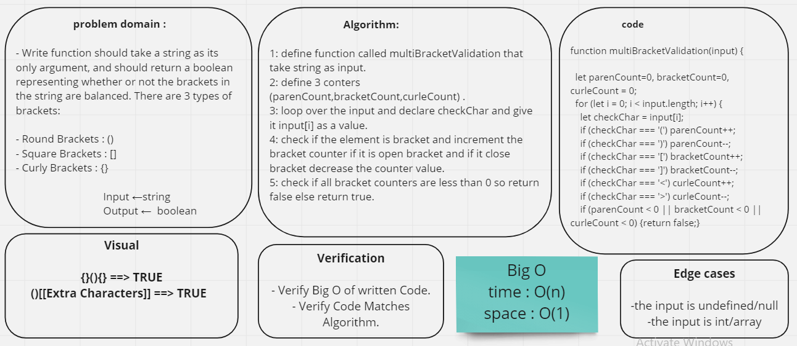

#

## Challenge

- Write function should take a string as its only argument, and should return a boolean representing whether or not the brackets in the string are balanced. There are 3 types of brackets:

- Round Brackets : ()
- Square Brackets : []
- Curly Brackets : {}

 

## Whiteboard

## Solution
[test](https://github.com/AnwarAbbass/data-structures-and-algorithms/runs/2725285335?check_suite_focus=true)

