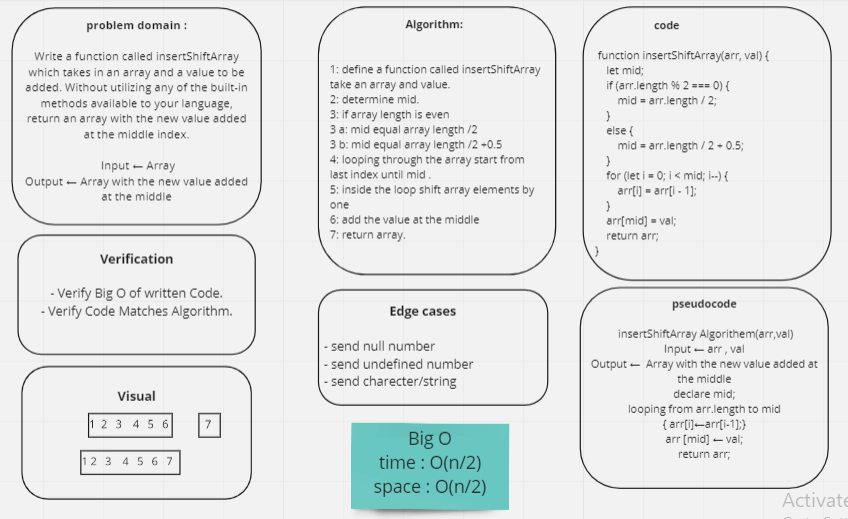

# Insert to Middle of an Array
Write a function called `insertShiftArray` which takes in an array and a value to be added. Without utilizing any of the built-in methods available to your language, return an array with the new value added at the middle index.

## Whiteboard Process

## Approach & Efficiency
at the first, define a middle variable and its value is the middle index in the array, then loop over the array to shift array elements after that assign the new value at the mid 